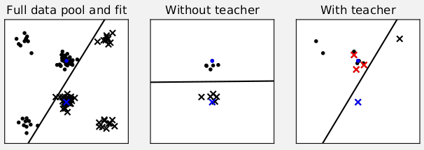

 * [paper](https://papers.nips.cc/paper/9299-machine-teaching-of-active-sequential-learners)
 * [poster](poster.pdf)
 * [code](https://github.com/AaltoPML/machine-teaching-of-active-sequential-learners/)

  
The figure shows an example of teaching effect on pool-based logistic regression active learner. The left-panel shows a pool of labelled data (dots and crosses) and a logistic regression decision boundary fit to the full pool. The middle panel shows how an active learner, using uncertainty sampling to query labels for points in the data pool, fails to sample useful points in 10 iterations to learn a good decision boundary (starting from blue training data). As shown in the right panel, a planning teacher can steer the learner to sample more representative points by switching some labels (switched labels are shown in red).

**Abstract**:

Machine teaching addresses the problem of finding the best training data that can guide a learning algorithm to a target model with minimal effort. In conventional settings, a teacher provides data that are consistent with the true data distribution. However, for sequential learners which actively choose their queries, such as multi-armed bandits and active learners, the teacher can only provide responses to the learner's queries, not design the full data. In this setting, consistent teachers can be sub-optimal for finite horizons. We formulate this sequential teaching problem, which current techniques in machine teaching do not address, as a Markov decision process, with the dynamics nesting a model of the learner and the actions being the teacher's responses. Furthermore, we address the complementary problem of learning from a teacher that plans: to recognise the teaching intent of the responses, the learner is endowed with a model of the teacher. We test the formulation with multi-armed bandit learners in simulated experiments and a user study. The results show that learning is improved by (i) planning teaching and (ii) the learner having a model of the teacher. The approach gives tools to taking into account strategic (planning) behaviour of users of interactive intelligent systems, such as recommendation engines, by considering them as boundedly optimal teachers.

**Reference**:

Tomi Peltola, Mustafa Mert Çelikok, Pedram Daee, Samuel Kaski 
**Machine Teaching of Active Sequential Learners** 
NeurIPS 2019

An earlier version of the paper, titled *Modelling User's Theory of AI's Mind in Interactive Intelligent Systems*, with a larger focus on human-computer interaction and user modelling is available as [version 2 on arXiv](https://arxiv.org/abs/1809.02869v2).

